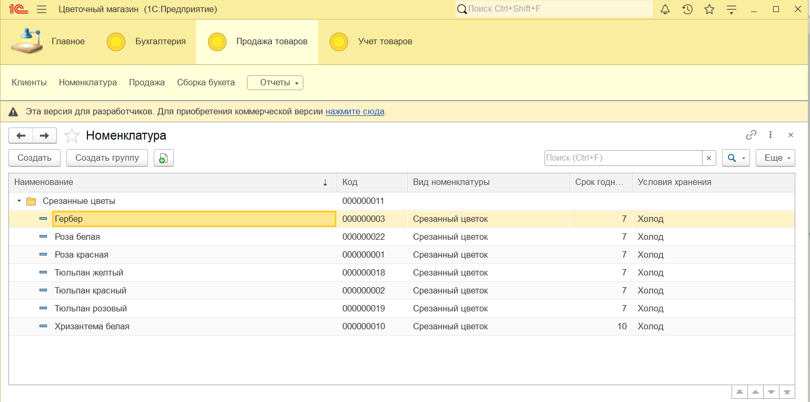
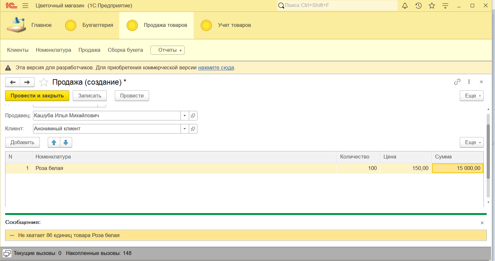
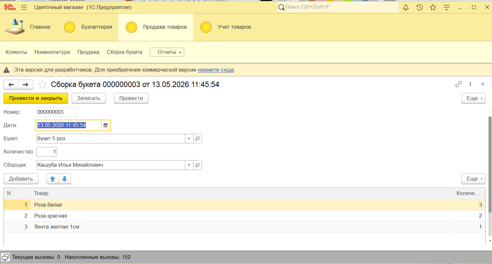
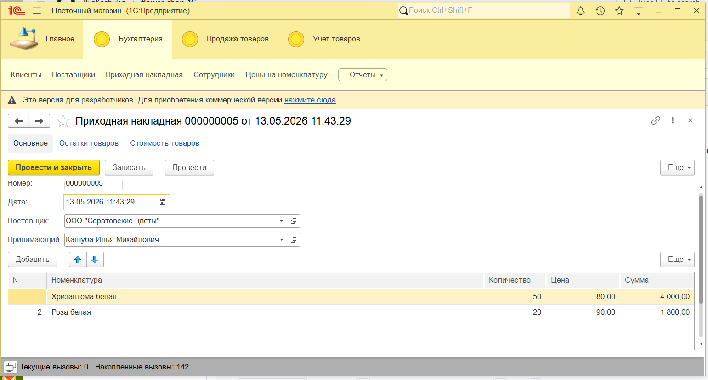
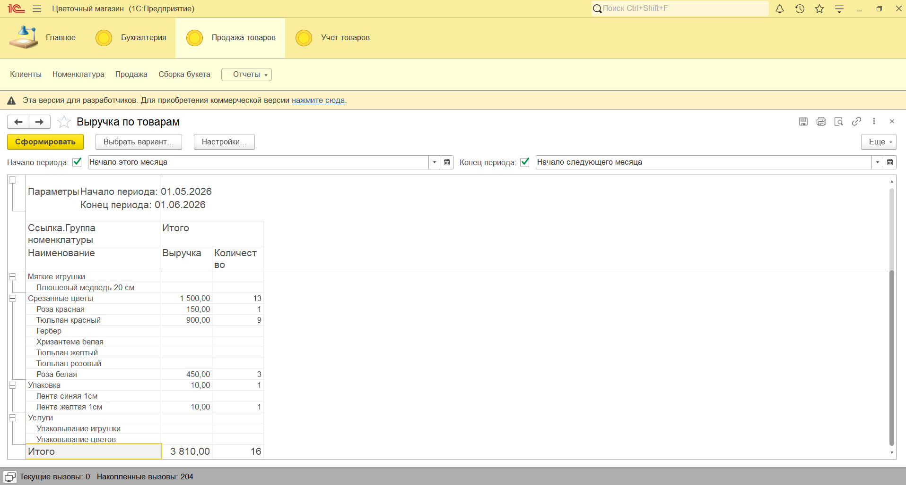
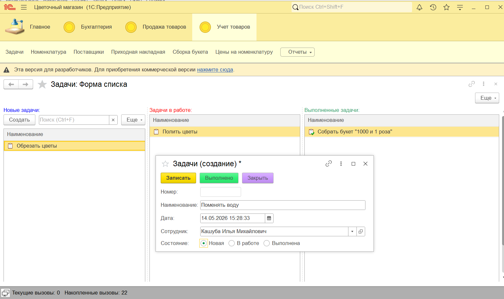

# 🌸 Цветочный магазин — Учебная конфигурация на 1С:Предприятие 8.5

Учебный проект для отработки навыков проектирования и разработки на платформе 1С:Предприятие 8.5.  
Конфигурация реализует базовые бизнес-процессы цветочного магазина: закупки, сборку букетов, розничные продажи, складской учёт и ценообразование.

## Стек и инструменты
- **Платформа:** 1С:Предприятие 8.5 (Community-лицензия)
- **Среда разработки:** 1C:EDT + Git

## Реализованный функционал

### Справочники
- `Номенклатура` — учёт сырья, готовых букетов и сопутствующих товаров
- `Клиенты` / `Поставщики` / `Сотрудники` — работа с контрагентами и персоналом

### Документы
- `ПриходнаяНакладная` — регистрация поступления товаров от поставщиков
- `СборкаБукета` — производство готовых букетов из компонентов
- `Продажа` — фиксация розничных реализаций с формированием движений по регистрам

### Регистры
- **Сведений:** `Цены` — хранение розничных цен на номенклатуру
- **Накопления:** 
  - `ОстаткиТоваров` — учёт физического наличия на складе
  - `Продажи` — история реализаций для аналитики
  - `СтоимостьТоваров` — учёт себестоимости (метод средней стоимости)

### Отчёты (на базе СКД)
- `ОстаткиТоваров` — текущие складские остатки
- `ВыручкаПоКассирам` — анализ продаж по сотрудникам
- `РейтингКлиентов` — топ-клиенты по объёму покупок
- `ВыручкаПоТоварам` — аналитика популярности ассортимента
- `Универсальный` — гибкий отчёт с настраиваемыми измерениями и ресурсами
- `РеестрДокументовПродажа` — детализированный журнал продаж

## Бизнес-логика и проведение документов
-  **ПриходнаяНакладная**: формирует приходные движения по `ОстаткиТоваров` и фиксирует закупочную стоимость в `СтоимостьТоваров`.
-  **СборкаБукета**: 
  - Проверяет достаточность остатков компонентов перед проведением
  - Формирует расход компонентов и приход готового букета в `ОстаткиТоваров`
  - Корректно распределяет себестоимость сырья на готовое изделие
-  **Продажа**:
  - Автоматическая проверка доступности товаров при проведении
  - Расчёт суммы продажи: `Цена` (из регистра `Цены`) × `Количество`
  - Расчёт себестоимости реализации: средневзвешенная стоимость из регистра `СтоимостьТоваров`
  - Формирует движения по `ОстаткиТоваров` (расход) и `Продажи` (аналитика)    

## План развития 
- [ ] Учёт срока годности цветов (списывание товаров)
- [ ] автоматическая уценка при достижении 75% срока годности
- [ ] расчет суммы продажи с учетом персональной скидки клиентам
- [ ] Покрытие бизнес-логики автотестами

## Скриншоты

### Справочник "Номенклатура"

### Документ "Продажа"

### Документ "Сборка букета"

### Документ "Приходная накладная"

### Отчёт "Выручка по товарам"

### Задачи и канбан-доска

